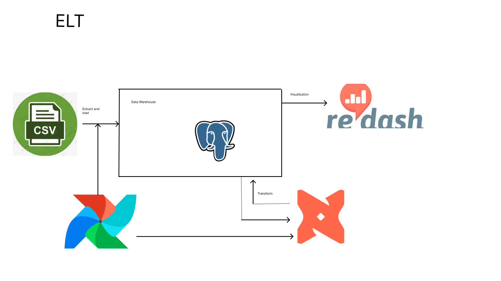

# Traffic-ELT-pipeline

[![Contributors][contributors-shield]][contributors-url]
[![Forks][forks-shield]][forks-url]
[![Stargazers][stars-shield]][stars-url]
[![Issues][issues-shield]][issues-url]
[![LinkedIn][linkedin-shield]][linkedin-url]


<!-- PROJECT LOGO -->
<br />
<p align="center">
  <h3 align="center">Sensor Data ELT</h3>

  <p align="center">
    A fully dockerized ELT pipeline project, using Airflow, PostgreSQL, DBT, and Redash.
    <br />
    <a href="https://github.com/nahomHmichael/Traffic-ELT-pipeline/issues">Report Bug</a>
    ·
    <a href="https://github.com/nahomHmichael/Traffic-ELT-pipeline/issues">Request Feature</a>
  </p>
</p>


<!-- TABLE OF CONTENTS -->
<details open="open">
  <summary>Table of Contents</summary>
  <ol>
    <li>
      <a href="#about-the-project">About The Project</a>
      <ul>
        <li><a href="#built-with">Built With</a></li>
      </ul>
    </li>
    <li>
      <a href="#getting-started">Getting Started</a>
      <ul>
        <li><a href="#prerequisites">Prerequisites</a></li>
        <li><a href="#installation">Installation</a></li>
      </ul>
    </li>
    <li><a href="#contact">Contact</a></li>
    <li><a href="#acknowledgements">Acknowledgements</a></li>
  </ol>
</details>


<!-- ABOUT THE PROJECT -->
## About The Project

<p align="center">
     
</p>

Fully dockerized scalable ELT pipeline using PostgreSQL, Airflow, DBT and Redash.


### Built With

Tech Stack used in this project
* [Airflow](https://airflow.apache.org/)
* [PostgreSQL](https://postgresql.com)
* [DBT](https://www.getdbt.com/)
* [Redash](https://redash.io/)


<!-- GETTING STARTED -->
## Getting Started

### Prerequisites

Make sure you have docker installed on local machine.
* Docker
* DockerCompose
  
### Installation

1. Clone the repo and Navigate
   ```sh
   git clone https://github.com/nahomHmichael/Traffic-ELT-pipeline.git
   ```
2. Run
   ```sh
    docker-compose -f docker-compose.yaml up --build
   ```
3. Open Airflow web browser
   ```JS
   Navigate to `http://localhost:8081/` on the browser
   activate and trigger the `load_to_dwh_v2` dag
   activate and trigger the `dbt_orchestrate` dag
   ```
4. Access redash dashboard
   ```JS
   Navigate to `http://localhost:3500/` on the browser
   ```
5. Access your postgres database
   ```JS
   Navigate to `http://localhost:5432/` on the browser
   use `warehouse` for db name
   use `warehouse` for username
   use `warehouse` for password
   ```

<!-- CONTACT -->
## Contact

Nahom Habtemichael - nahomhabtemichael@gmail.com


<!-- ACKNOWLEDGEMENTS -->
## Acknowledgements
* [10 Academy](https://www.10academy.org/)


<!-- MARKDOWN LINKS & IMAGES -->
<!-- https://www.markdownguide.org/basic-syntax/#reference-style-links -->
[contributors-shield]: https://img.shields.io/github/contributors/nahomHmichael/Traffic-ELT-pipeline.svg?style=for-the-badge
[contributors-url]: https://github.com/nahomHmichael/Traffic-ELT-pipeline/graphs/contributors
[forks-shield]: https://img.shields.io/github/forks/nahomHmichael/Traffic-ELT-pipeline.svg?style=for-the-badge
[forks-url]: https://github.com/nahomHmichael/Traffic-ELT-pipeline/network/members
[stars-shield]: https://img.shields.io/github/stars/nahomHmichael/Traffic-ELT-pipeline.svg?style=for-the-badge
[stars-url]: https://github.com/nahomHmichael/Traffic-ELT-pipeline/stargazers
[issues-shield]: https://img.shields.io/github/issues/nahomHmichael/Traffic-ELT-pipeline.svg?style=for-the-badge
[issues-url]: https://github.com/nahomHmichael/Traffic-ELT-pipeline/issues
[license-shield]: https://img.shields.io/github/license/nahomHmichael/Traffic-ELT-pipeline.svg?style=for-the-badge
[license-url]: https://github.com/nahomHmichael/Traffic-ELT-pipeline/blob/master/LICENSE.txt
[linkedin-shield]: https://img.shields.io/badge/-LinkedIn-black.svg?style=for-the-badge&logo=linkedin&colorB=555
[linkedin-url]: https://www.linkedin.com/in/nahom-habtemichael-5b3aa3231
[product-screenshot]: images/architecture.png
